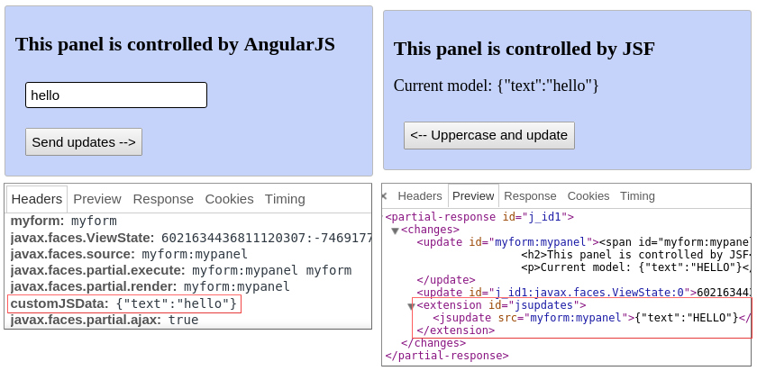
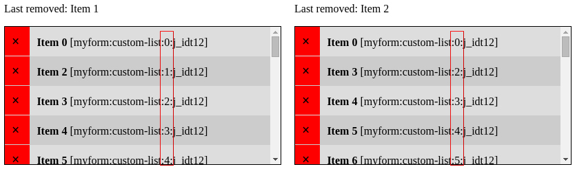

# Examples of customized Java Server Faces AJAX calls

JSF AJAX mechanism automatically refresh pieces of the page specified by the `render` attribute of the tag `f:ajax`:

    <f:ajax render="idofmyelement" />

Usually this is good but there are situations in which you need better control on the updates (both to avoid some problems with focus and scrolling and to send customized data manipulated using only JavaScript to the server).

JSF AJAX updates are perfomed sending an XML response containing a collection of `<change>` tag elements. The class responsable for creating this response is the `PartialResponseWriter`.

JSF allows you to replace a lot of its parts with you custom implementation, and fortunately you can replace the original `PartialResponseWriter`.
You can override that class and use its method `startExtension()` to add a custom tag inside the response and read it using a JavaScript function (the function will be called [3 times](http://stackoverflow.com/a/13540905/771431): you have to check inside it that the status of the event object passed as parameter has to be equal to "success" to read the response).

This project show you 3 examples in which a customized `PartialResponseWriter` is used to obtain custom communications between JavaScript functions and JSF.

> **Note**: this examples use pure JSF. If you need to solve JSF AJAX problems you cold be interested also in taking a look at [OmniFaces Ajax methods](http://showcase.omnifaces.org/utils/Ajax).

> **Note**: this examples were tested on Glassfish 4.1

## Example 1: updating only one attribute of an element
> (Aka: avoid update focus problem on inputText keyup/keydown)

Suppose you would change the class of an input text while writing in it:

An idea could be use this code:

    <h:inputText value="#{myBean.text}" class="#{myBean.inputCss}">
        <f:ajax render="@this" event="keyup" />
    </h:inputText>

But in this way after each AJAX response (each keyup) a new input element will be generated and added to the DOM.
The annoying side effect of this approach is evident: you will lose the focus on that input every time!

So you can set your `f:ajax` without the `render` attribute and use your backing bean to notify the customized `PartialResponseWriter` for adding to the response some informations that will be used by a JavaScript function to manually manipulate the class attribute of the input.

## Example 2: mixing AngularJS and JSF

Usually if you are creating an AngularJS application in a Java EE environment you **should** use AngularJS with a **REST service** (as Jersey).
But if you want to integrate a small AngularJS application in a piece of your page and do all the other things in JSF way you could consider using the approach of the custom `PartialResponseWriter` to send and receive a JSON model:

Here the JavaScript [`jsf.ajax.request`](https://docs.oracle.com/cd/E17802_01/j2ee/javaee/javaserverfaces/2.0/docs/js-api/symbols/jsf.ajax.html) function is used.

*Note*: for AngularJS you could also consider the approach of the [**AngularBeans**](http://bessemhmidi.github.io/AngularBeans/) project.

## Example 3: removable items list in a scrollable container

Suppose you have a list of removable elements in a scrollable container. If you have some vertical scroll and you refresh the list using JSF AJAX you will loose your scroll.

In this situation you could think to do the AJAX call avoiding to render the list and doing the removal of the item using JavaScript:

    <h:commandLink>
        <f:ajax onevent="itemRemoved" />
    </h:commandLink>

    function itemRemoved(event) {
        if(event.status === 'success') {
            $(event.source).closest('li').remove();
        }
    }

Unfortunately this doesn't work correctly because the ids of elements following the one that was removed should be updated:

So, if you remove the item using JavaScript you have also to manually change the ids of the elements.
You could recalculate the numbers inside the ids but to avoid depending on a particular string you could also tell to the PartialResponseWriter to write the updates inside your extension element (method `renderElement()` of the class `CustomUpdateResponseWriter` in this examples).
In this way you can see the changes in the response but they are not automatically applied to the DOM and you can manage them manually using JavaScript.

This last example maybe is an ugly workaround but the alternatives are to manually restore the scroll position or to manage the entire list functionalities using JavaScript.

## Credits

- [Inserting custom tag in JSF Ajax response XML](http://stackoverflow.com/a/12198117/771431)
- [How to use jsf.ajax.request to manually send ajax request in JSF](http://stackoverflow.com/a/15571052/771431)
- [Listen and debug JSF lifecycle phases](http://balusc.omnifaces.org/2006/09/debug-jsf-lifecycle.html)
